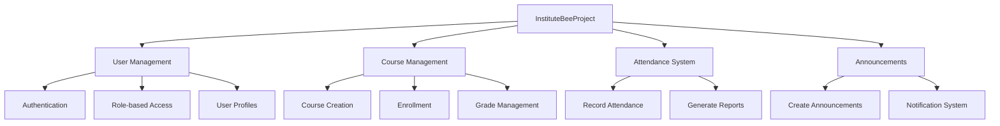
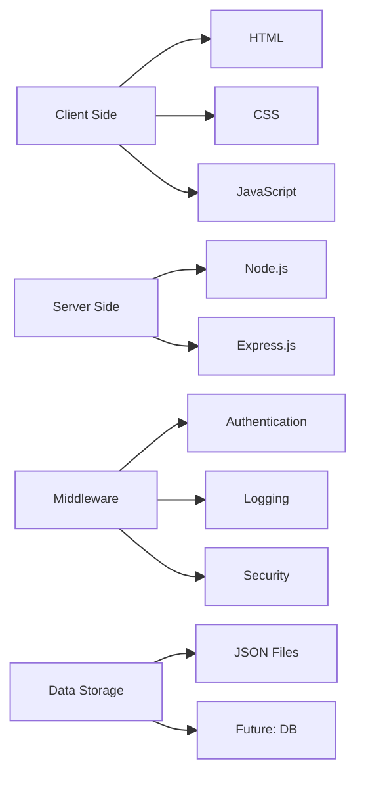
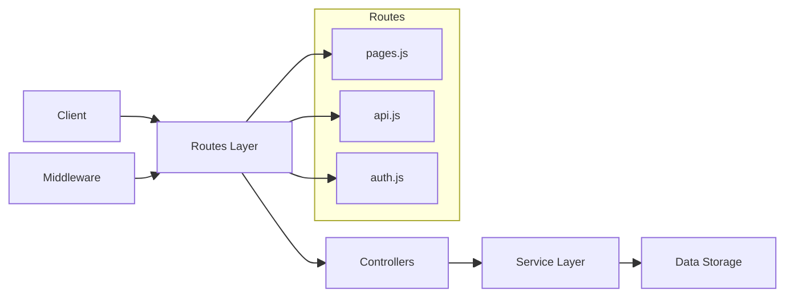
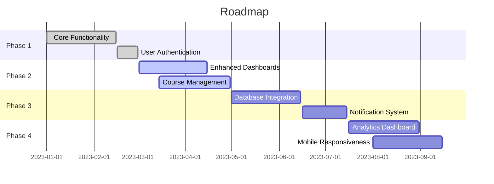

# 📚 Institute Management System

Welcome to the **InstituteBeeProject**, a web application built using **Node.js, Express.js**, and **HTML/CSS** to manage student, staff, and admin functionalities efficiently. This project is designed to streamline academic processes, including attendance tracking, course management, and user authentication.

---

## 📊 Project Overview



---

## 🚀 Features

- **User Authentication**: Secure login and registration system.
- **Role-Based Dashboards**: Dedicated views for students, staff, and admin users.
- **Dynamic Student Dashboard**: Displays personalized student information and courses.
- **Attendance Tracking**: View and update attendance records.
- **Course Management**: Access course details dynamically.
- **Secure Routing & Middleware**: Express.js handles authentication and error management.
- **Announcements**: System for sharing important updates.
- **Contact Us**: Direct communication channel for support.

---

## 📂 Project Structure

```
📁 InstituteBeeProject
 ├── 📁 middleware             # Authentication and other middleware
 │   └── auth.js               # Authentication middleware
 ├── 📁 public                 # Static files (HTML, CSS, JS)
 │   ├── adminDashboard.html   # Admin control panel
 │   ├── anouncement.html      # Announcements page
 │   ├── attendance.html       # Attendance management
 │   ├── contactus.html        # Contact form
 │   ├── courseMngmnt.html     # Course management
 │   ├── error.html            # Error page
 │   ├── index.html            # Landing page
 │   ├── login.html            # Login page
 │   ├── register.html         # Registration page
 │   ├── staffDashboard.html   # Staff portal
 │   ├── studentDashboard.html # Student portal
 │   ├── users.json            # Stores user data
 ├── 📁 routes                 # API and page routing
 │   ├── api.js                # API endpoints
 │   ├── auth.js               # Authentication routes
 │   ├── pages.js              # Page routing
 ├── server.js                 # Main Express.js server
 ├── serverold.js              # Previous server version
 ├── package.json              # Project dependencies
 ├── package-lock.json         # Locked dependencies
 ├── README.md                 # Project documentation
 ├── ST1 Project Guideline.txt # Phase 1 guidelines
 ├── ST2 Project Guideline.txt # Phase 2 guidelines
```


---

## 🛠️ Technologies Used

- **Node.js** - JavaScript runtime environment
- **Express.js** - Fast and minimal web framework
- **HTML/CSS** - Frontend UI structure
- **JavaScript (ES6+)** - Interactive client-side scripting
- **Helmet, Morgan, CORS** - Middleware for security and logging

## 📊 Technology Stack



---

## ⚙️ Installation & Setup

1. Clone the repository:
   ```sh
   git clone https://github.com/Anuj-er/InstituteBeeProject.git
   ```
2. Navigate to the project directory:
   ```sh
   cd InstituteBeeProject
   ```
3. Install dependencies:
   ```sh
   npm install
   ```
4. Start the server:
   ```sh
   node server.js
   ```
5. Open in browser:
   ```sh
   http://localhost:8080
   ```


---


## 📌 API Endpoints

| Method | Endpoint              | Description                 |
|--------|----------------------|-----------------------------|
| GET    | `/`                  | Home Page                   |
| GET    | `/login`             | Login Page                  |
| GET    | `/register`          | Registration Page           |
| GET    | `/studentDashboard`  | Student Dashboard           |
| GET    | `/staffDashboard`    | Staff Dashboard             |
| GET    | `/adminDashboard`    | Admin Dashboard             |
| GET    | `/api/user`          | Fetch logged-in user data   |
| GET    | `/api/courses`       | Fetch student courses       |
| GET    | `/announcements`     | View announcements          |
| GET    | `/contactus`         | Contact page                |

## 🔄 API Architecture



---

## 🏗️ Future Enhancements

- 🔹 **Database Integration** (Replace `users.json` with MongoDB/PostgreSQL)
- 🔹 **Advanced Course & Attendance Management**
- 🔹 **Notification System** for students and staff
- 🔹 **Responsive Design** for mobile accessibility
- 🔹 **Analytics Dashboard** for tracking performance metrics

## 📊 Development Roadmap



---

## 🤝 Contributing

Contributions are welcome! Feel free to fork the repo, open an issue, or submit a pull request.

Visit our [GitHub repository](https://github.com/Anuj-er/InstituteBeeProject) to contribute.


---

## 📜 License

This project is open-source and available under the MIT License.

Happy coding! 🚀
